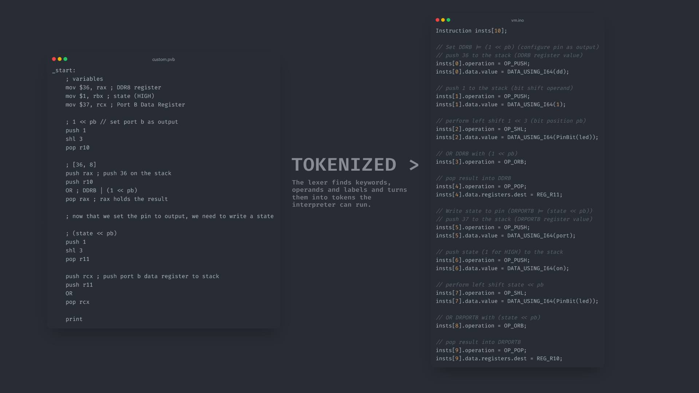
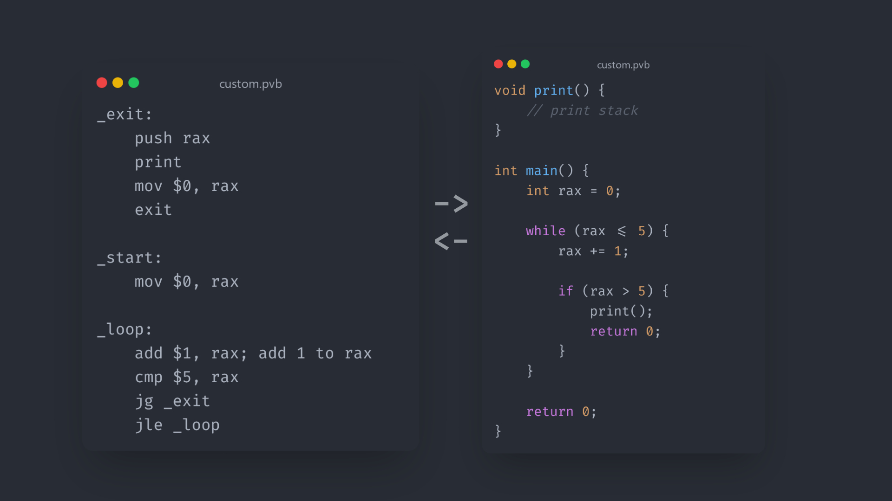

# Provrb VM
This project introduces a custom x86_64 Assembly-like language feature similiar syntax, operations, and syscalls. 

# How it Works
The applicaton consists of a lexer and bytecode virtual machine. After running the virtual machine with your .pvb file as an input, the lexer will break each instruction into tokens. 

For eaxmple, a move instruction may look like this: 
```
mov $5, rax ; here we are moving the number 5 into register 'rax'
```
And be tokenized as such:
```
OPCODE: OP_MOV, VALUE: 5 (i64), DEST: rax (index 1 in memory), SRC: NONE
```



If an instruction is invalid (insufficient amount of operands, unknown instruction, etc) or there is no '_start:' function/label declared, the lexer will throw a syntax error before running, and will provide a description on the error. 

After a successful lexical analysis, the virtual machine will run each instruction, increasing the virtual machines instruction pointer. The instruction pointer corresponds to which instruction to run in an array of instructions. 

Depending on the opcode in the instruction, the virtual machjine will perform an action. When jumping, the virtual machine can simply increment the instruction pointer a certain amount of times to skip previous instructions easily.

A .pvb program would like as a C program as such
