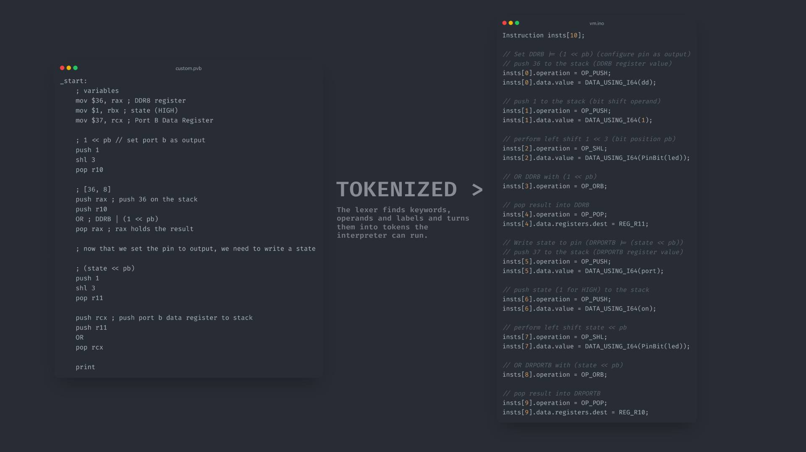
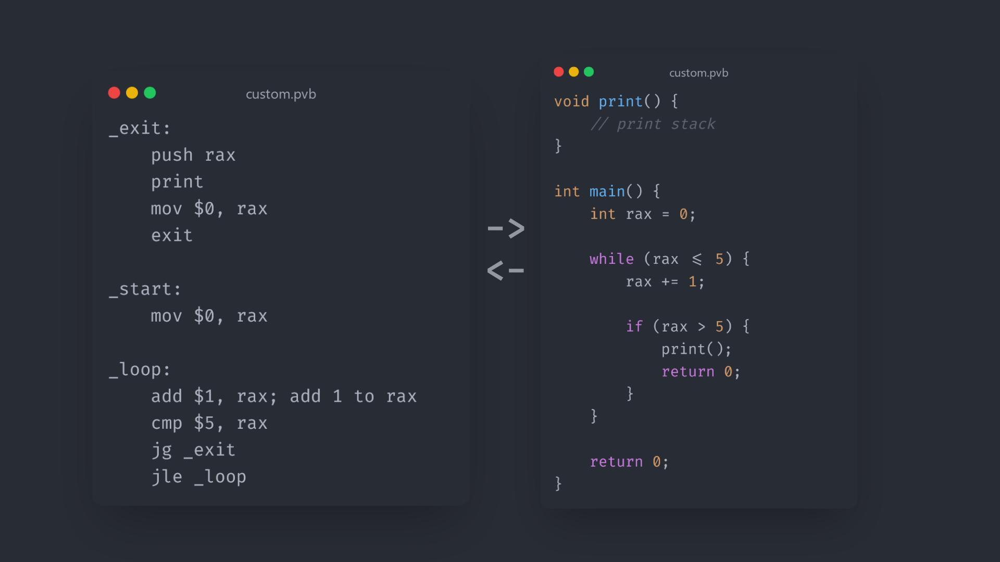

# Provrb VM

A tiny custom virtual machine and assembly-like language written in C.

This project is a great example of a small interpreter pipeline:

- read `.pvb` source files
- tokenize instructions with a lexer
- convert them into `Instruction` objects
- execute them in a simulated machine with registers, flags, and a stack
- support low-level syscall-like behavior

## Why this project is interesting

It blends ideas from:

- assembly language
- virtual machines
- interpreters
- low-level systems programming
- CPU-style control flow and branching

## Quick example

```asm
_start:
    mov $5, rax
    mov $7, rbx
    add rbx, rax
    push rax
    print
    exit
```

This moves values into registers, adds them, pushes the result onto the stack, prints the stack, and exits.

## Learn more

The full guide lives here:

- `docs/language-guide.md`

It includes:

- instruction references
- syscall documentation
- beginner-friendly explanations
- recruiter-friendly summaries
- examples you can run in the repo

## Repo layout

- `src/lexer.c` - parsing and tokenization
- `src/inst.h` - instruction and syscall definitions
- `src/inst.c` - execution logic and VM runtime
- `examples/` - sample programs
- `docs/` - language notes and reference material

## Build and run

```bash
./build.sh
```

This compiles the VM and runs it against `file.pvb`.

## Recruiter summary

> This project is a custom virtual machine and assembly-like interpreter built in C. It parses source code, validates syntax, models a register file and stack, executes low-level instructions, and exposes a syscall interface. It demonstrates systems thinking, compiler/runtime concepts, and control-flow logic in a compact, practical project.

## Visuals



